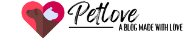

<div id="top"></div>

<!-- PROJECT LOGO -->
<br />
<div align="center">
  <a href="https://github.com/github_username/repo_name">
    
  </a>

<h3 align="center">Petlove</h3>

  <p align="center">
    A small project to learn HTML and CSS :)
    <br />
    <a href="https://github.com/xAcid27/petlove"><strong>Explore the docs »</strong></a>
    <br />
    <br />
    <a href="https://paetlove-blog.com">View Page</a>
    ·
    <a href="https://github.com/xAcid27/petlove/issues">Report Bug</a>
    ·
    <a href="https://github.com/xAcid27/petlove/issues">Request Feature</a>
  </p>
</div>


<!-- TABLE OF CONTENTS -->
<details>
  <summary>Table of Contents</summary>
  <ol>
    <li>
      <a href="#about-the-project">About The Project</a>
      <ul>
        <li><a href="#built-with">Built With</a></li>
      </ul>
    </li>
    <li>
      <a href="#getting-started">Getting Started</a>
      <ul>
        <li><a href="#prerequisites">Prerequisites</a></li>
      </ul>
    </li>
    <li><a href="#usage">Usage</a></li>
    <li><a href="#roadmap">Roadmap</a></li>
    <li><a href="#contact">Contact</a></li>
  </ol>
</details>


<!-- ABOUT THE PROJECT -->
## About The Project

[![Product Name Screen Shot][product-screenshot]](https://petlove-blog.com)

Hey, as mentioned above, it's a little learning project to learn HTML and CSS. Why exactly a blog about animals? I've already grown up with animals, accordingly I've built up a fascination and love for them. So I thought, why not combine the two. So here we are. I hope you guys like it. `xAcid27`, `Petlove Blog`

<p align="right">(<a href="#top">back to top</a>)</p>


### Built With

* [HTML](https://wiki.selfhtml.org/wiki/HTML)
* [CSS](https://wiki.selfhtml.org/wiki/CSS)
* [JavaScript](https://www.javascript.com)

<p align="right">(<a href="#top">back to top</a>)</p>


<!-- GETTING STARTED -->
## Getting Started

as mentioned above it is a small project to get familiar with HTML, CSS and Java. 
I also wanted to dedicate myself to Adsense and SEO. I hope you like the project. 

### Prerequisites

Enable Java in your browser to avoid errors. But this should not be a problem by default
* Java
  ```sh
  https://java.com/de/download/help/enable_browser.html
  ```
  
<!-- USAGE EXAMPLES -->
## Usage

It is so far just a simple blog website without many features. But I will probably add them with time.

_Check the Webite with the Link [Documentation](https://petlove-blog.com.com)_

<p align="right">(<a href="#top">back to top</a>)</p>


<!-- ROADMAP -->
## Roadmap

- [ ] Fix Broken Links
    - [ ] Fix Broken Pages 
- [ ] Add CCPA and DSGVO
    - [ ] Add AdSense
    - [ ] Optimize SEO 
- [ ] Add a Formpage with better Contact us
    - [ ] Add a Loginsystem
    - [ ] Add a Commentsystem

See the [open issues](https://github.com/github_username/repo_name/issues) for a full list of proposed features (and known issues).

<p align="right">(<a href="#top">back to top</a>)</p>


<!-- CONTACT -->
## Contact

xAcid - [Add me on Discord](discordapp.com/users/280797150059823123)

Project Link: [https://github.com/xAcid27/petlove](https://github.com/xAcid27/petlove)

<p align="right">(<a href="#top">back to top</a>)</p>

<!-- MARKDOWN LINKS & IMAGES -->
<!-- https://www.markdownguide.org/basic-syntax/#reference-style-links -->
[contributors-shield]: https://img.shields.io/github/contributors/github_username/repo_name.svg?style=for-the-badge
[contributors-url]: https://github.com/github_username/repo_name/graphs/contributors
[forks-shield]: https://img.shields.io/github/forks/github_username/repo_name.svg?style=for-the-badge
[forks-url]: https://github.com/github_username/repo_name/network/members
[stars-shield]: https://img.shields.io/github/stars/github_username/repo_name.svg?style=for-the-badge
[stars-url]: https://github.com/github_username/repo_name/stargazers
[issues-shield]: https://img.shields.io/github/issues/github_username/repo_name.svg?style=for-the-badge
[issues-url]: https://github.com/github_username/repo_name/issues
[license-shield]: https://img.shields.io/github/license/github_username/repo_name.svg?style=for-the-badge
[license-url]: https://github.com/github_username/repo_name/blob/master/LICENSE.txt
[linkedin-shield]: https://img.shields.io/badge/-LinkedIn-black.svg?style=for-the-badge&logo=linkedin&colorB=555
[linkedin-url]: https://linkedin.com/in/linkedin_username
[product-screenshot]: images/screenshot.png
